# 로그인 경보 자동화 봇

## ① 무엇을 만들었나

파이썬이 보낸 가상의 로그인 경보를 n8n이 스스로 판정(허용/거부)해서, 슬랙·디스코드·텔레그램 세 곳에 알리고, 게시판 서버의 REST API를 통해 MySQL에 기록까지 자동으로 남기는 봇입니다. 판정 결과는 웹 대시보드에서도 확인할 수 있습니다.

## ② 작업 내역

1. **`alert_sender.py`** — 경보 목록(정상 IP + 위험 IP)을 만들어 n8n Webhook으로 POST
2. **n8n Code 노드(판정)** — 레벨에 따라 `High/deny`, `Medium·Low/allow`로 분류, 사람이 읽을 수 있는 판정 사유(`reason`) 생성
3. **n8n If 노드** — `decision`이 `deny`인지 아닌지로 분기
4. **n8n Edit Fields 노드 2개** — 거부(🚫)/허용(✅) 각각 다른 형식의 알림 문구 생성
5. **슬랙·디스코드·텔레그램 노드** — 두 분기 모두에서 세 메신저로 전송
6. **게시판 서버 REST API 추가** (`POST/GET /api/security/events`) — X-API-Key 인증, `security_events` 테이블에 저장
7. **n8n HTTP 노드(게시판 저장)** — 판정 결과를 게시판 API로 전송해 DB에 기록
8. **보안 대시보드 페이지** — 허용/거부 건수 요약, 거부 상위 IP, 최근 이벤트 표 (심화 S1)

**사용 기술**: Python(requests) · n8n(Webhook, Code, If, HTTP Request) · Flask + SQLAlchemy · MySQL(Docker) · Slack/Discord/Telegram Webhook · Tailwind CSS

## ③ 기능 구현 화면

**파이썬 전송기** 
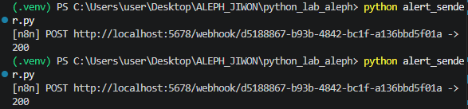

**n8n 판정 노드 결과** 
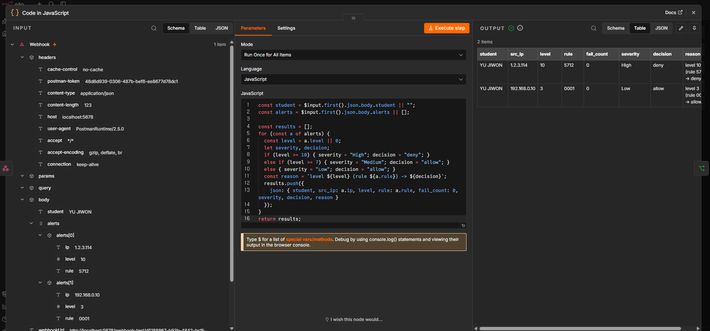

**n8n 워크플로우 전체 구조** 
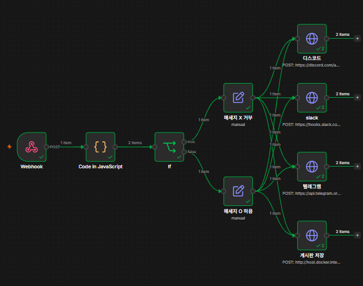

**메신저 알림 도착** (슬랙 · 디스코드 · 텔레그램)

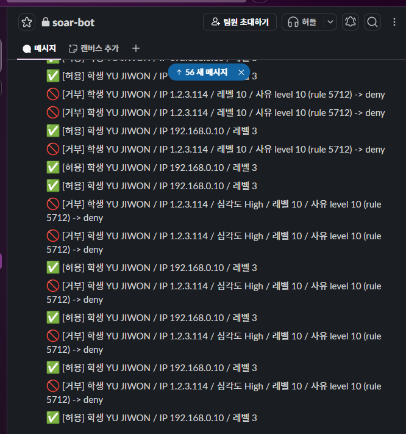 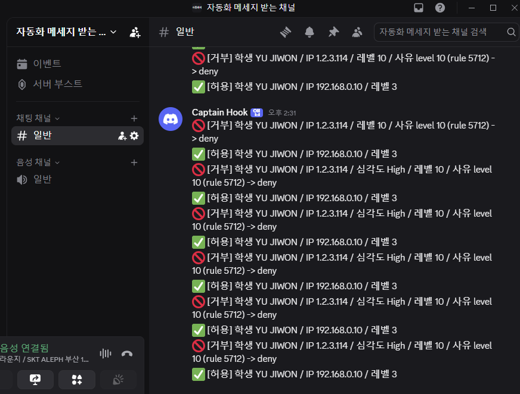 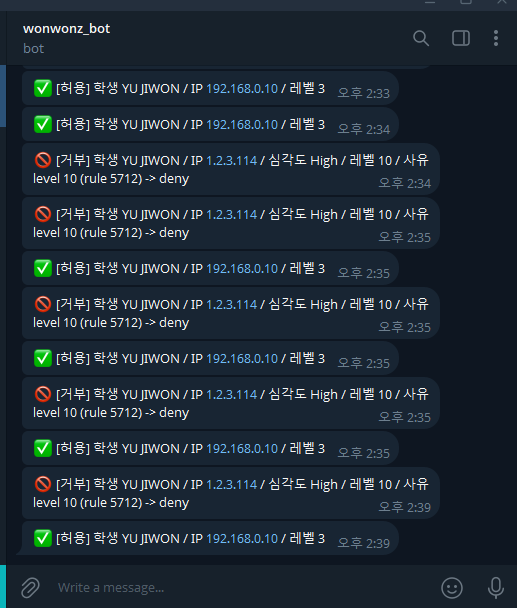

**MySQL 저장 결과** 
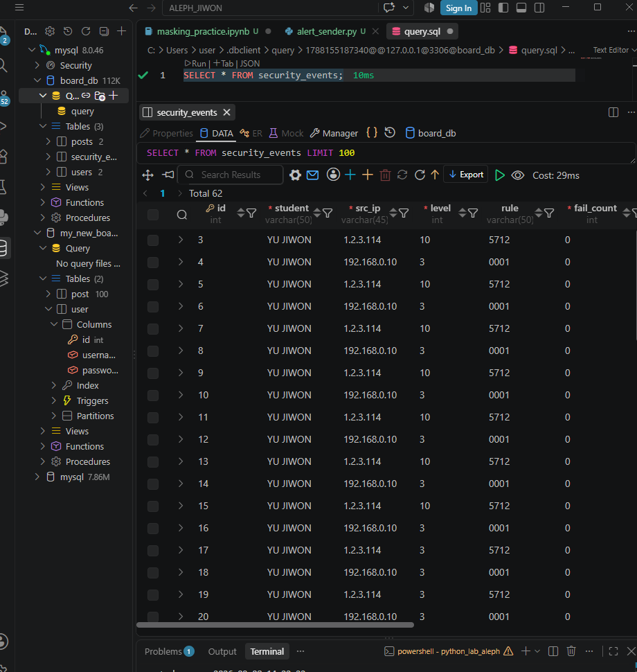

**본인 기록 조회 API** 
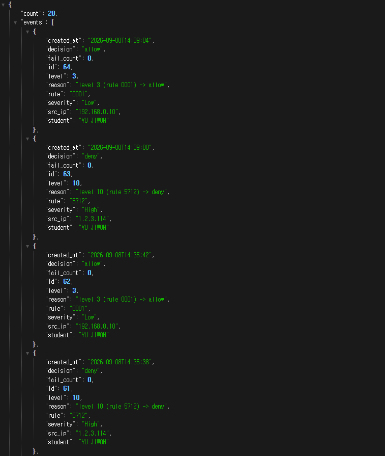

**REST API 인증/검증**

| API 키 없이 → 401 | 필수값 누락 → 400 |
|---|---|
| 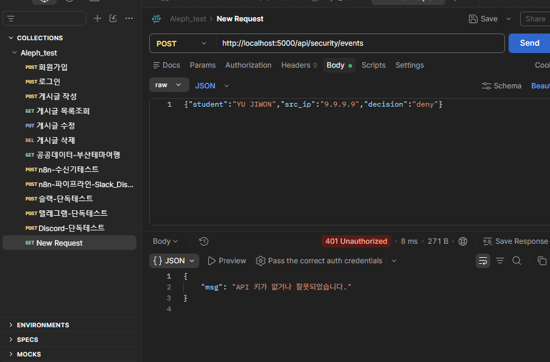 | 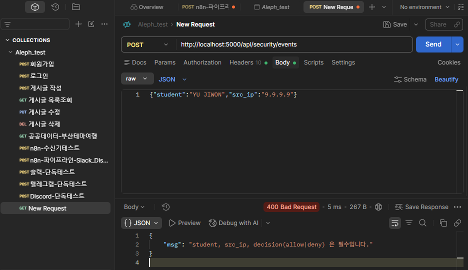 |

**n8n이 꺼져 있어도 죽지 않는 전송기** 
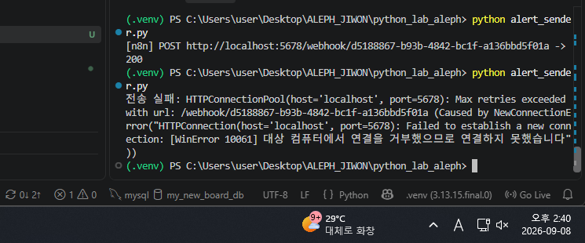

**거부 기준 상수 변경 비교** (10 → 3, 레벨 3 기준)

| 기준 10일 때 → 허용 | 기준 3일 때 → 거부 |
|---|---|
| 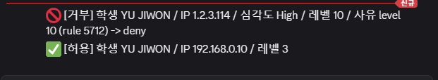 | 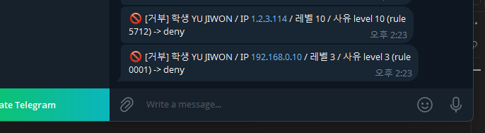 |

**Code 노드 언어 함정** 
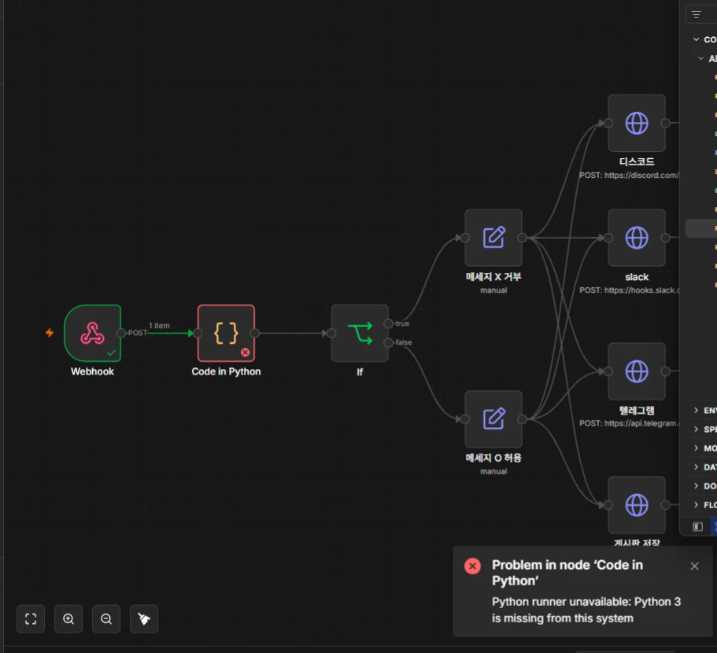

**보안 대시보드 (심화 S1)** 
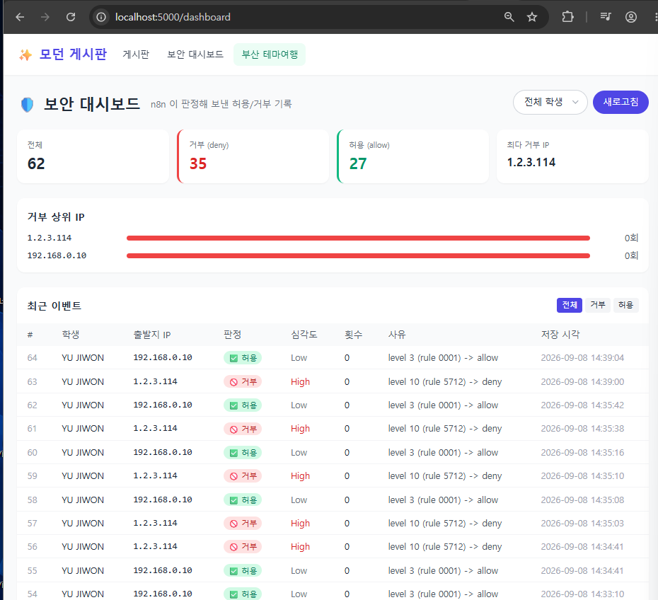

**n8n 실행 기록 (게시판 저장 성공)** 
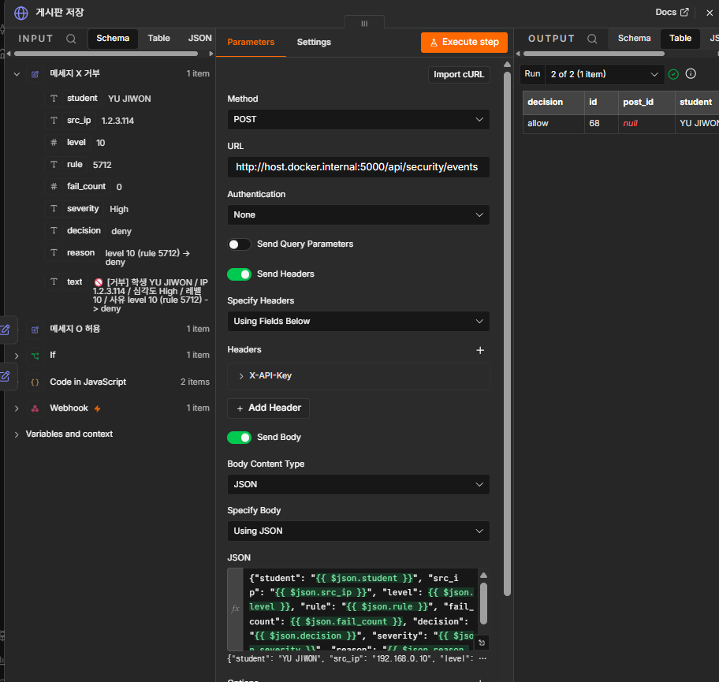

## ④ 실행 방법

1. **켜기**: Docker Desktop 실행 → MySQL·n8n 컨테이너 기동 (`docker start flask_mysql n8n`) → 게시판 서버 실행 (`python app.py`, `flask_board` 폴더에서)
2. **실행하기**: n8n 워크플로우를 Publish(Active) 상태로 두고, `python alert_sender.py` 실행
3. **성공 화면**: 터미널에 `[n8n] POST .../webhook/... -> 200` 출력, 슬랙/디스코드/텔레그램에 거부·허용 메시지 도착, `localhost:5000/dashboard`에서 새 기록 확인
4. **안 될 때 확인할 곳**:
   - n8n이 `404`를 주면 → 워크플로우가 Active인지, Test/Production URL을 맞게 썼는지 확인
   - 메시지에 `{{ ... }}`가 그대로 오면 → 해당 필드가 표현식 모드인지 확인
   - 게시판 저장이 실패하면 → 컨테이너 안에서 `localhost`는 자기 자신이므로 `host.docker.internal` 썼는지 확인

## ⑤ 막혔던 점과 해결 방법

1. **n8n Webhook 데이터 위치** — Code 노드에서 `$json.student`로 접근했더니 계속 빈 값이 나왔다. Webhook의 실제 페이로드는 `$json.body.student`처럼 `body` 아래에 들어있다는 걸 OUTPUT 패널로 확인하고 코드를 고쳤다.
2. **Code 노드 언어 함정** — Code 노드 언어를 Python으로 선택했더니 "Python runner unavailable: Python 3 is missing from this system" 오류가 났다. 이 n8n 컨테이너엔 파이썬 런타임이 없다는 뜻이라, 같은 로직을 JavaScript로 다시 작성해 해결했다.
3. **Test URL vs Production URL** — 포스트맨으로 계속 테스트했는데 어떤 요청은 바로 되고 어떤 건 404가 났다. `webhook-test/...`는 "Listen for test event"를 매번 눌러야 한 번만 동작하고, `webhook/...`(Production)은 워크플로우가 Publish된 상태면 별도 조작 없이 항상 동작한다는 차이를 확인하고, 반복 테스트는 Production URL로 진행했다.
